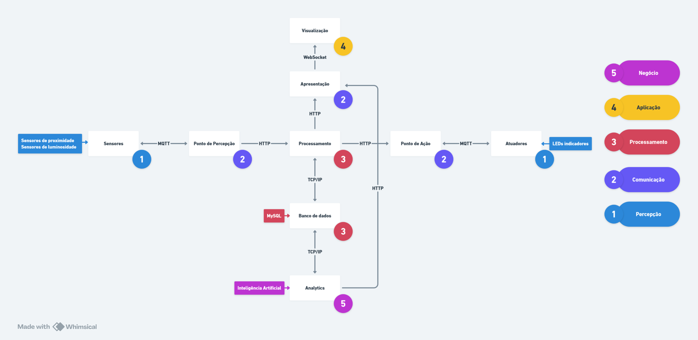

# Parkify

Introdução e apresentação do projeto Parkify.

# Tabela de Conteúdos

- [Parkify](#parkify)
- [Tabela de Conteúdos](#tabela-de-conteúdos)
- [Requisitos](#requisitos)
  - [Funcionais](#funcionais)
  - [Não Funcionais](#não-funcionais)
- [Arquitetura](#arquitetura)

# Requisitos

## Funcionais

- O sistema deve determinar se a vaga está ocupada ou livre com base nos sensores;
- O sistema deve processar as informações sensoriais para mostrar em tela;
- O sistema deve mostrar um diagrama com as vagas disponíveis;
- O sistema deve processar as informações para pós-processamento externo;
- O sistema deve mostrar em tela informações de estatística sobre o uso do local;
- O sistema deve atualizar o monitor periodicamente com as novas estatísticas;
- O sistema deve manipular o led de presença na vaga para mostrar se a vaga está disponível ou não;
- O sistema deve mostrar um alerta em tela para as mudanças de estado das vagas;
- O sistema deve gerenciar os dados do uso do estacionamento do usuário desde sua entrada.
- O sistema deve oferecer a mesma aplicação para acesso externo de consulta;

## Não Funcionais

- A Inteligência Artificial deve ser desenvolvida com Python, enquanto os atuadores e componentes serão comandados via Arduino, desenvolvidos com C/C++;
- A aplicação deve fornecer atualizações em tempo real sobre a disponibilidade de vagas, minimizando a latência entre a detecção do sensor e a exibição na interface de visualização;
- Sensores e atuadores devem ser monitorados continuamente para garantir que estão funcionando corretamente e detectar qualquer anomalia no sistema;
- A aplicação deve garantir que somente dispositivos autorizados (como sensores e atuadores) possam se conectar à rede para enviar ou receber dados;
- A inteligência artificial deve ser protegida contra manipulação de dados, garantindo que os resultados das análises (como vagas disponíveis) não sejam comprometidos;
- O sistema deve ser modular para facilitar futuras atualizações ou expansões, como a inclusão de novos sensores, novas funcionalidades de IA ou integração com sistemas de terceiros;
- O sistema deve ter ferramentas integradas para monitorar o desempenho da IA e da infraestrutura, facilitando a manutenção e a identificação de possíveis gargalos ou falhas;
- A aplicação deve ser compatível com diferentes tipos de sensores (proximidade, luminosidade, pressão, etc.) para facilitar a integração com diferentes tecnologias de estacionamento;
- O sistema deve seguir padrões de comunicação como MQTT e HTTP para permitir a integração com diferentes plataformas e dispositivos, além de suportar diferentes sistemas operacionais e dispositivos móveis;
- A interface para os usuários (motoristas) deve ser fácil de usar, com informações claras, diagramas e atualizadas sobre a disponibilidade de vagas próximas;
- A aplicação deve ser responsiva e compatível com dispositivos móveis, permitindo que os motoristas acessem as informações de vagas disponíveis enquanto estão em movimento;
- A IA deve ser capaz de prever com alta precisão a disponibilidade de vagas com base em dados históricos, padrões de movimento de veículos, e condições atuais do estacionamento;
- O modelo de IA deve ser continuamente treinado com novos dados para melhorar sua capacidade de prever e adaptar-se a mudanças nas condições de ocupação das vagas e comportamento dos motoristas.

# Arquitetura

